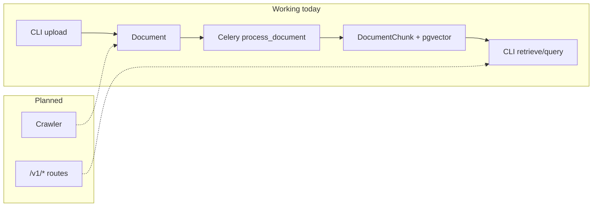

# RAG Crawler API

A RAG (Retrieval-Augmented Generation) system with a defined HTTP API contract and a working offline pipeline (CLI + Celery). The RAG pipeline indexes markdown documents, stores vectors in PostgreSQL/pgvector, and supports semantic retrieval with optional reranking and LLM-grounded answers. HTTP business routes are defined but not yet implemented — handlers return 501.

## Tech Stack

| Layer | Technology |
|-------|------------|
| API | FastAPI |
| Validation | Pydantic |
| Database | SQLAlchemy + PostgreSQL + pgvector |
| Background jobs | Celery + Redis |
| Embeddings / completions / rerank | OpenRouter (OpenAI SDK + HTTP rerank API) |
| Crawler | Custom pipeline (Playwright + BeautifulSoup) — skeletal, not wired |
| RAG | Custom pipeline |
| Tests | pytest + testcontainers |

## Architecture



## Implementation Status

| Component | Status |
|-----------|--------|
| RAG pipeline (chunk, embed, store, retrieve, rerank, answer) | Working via CLI + Celery |
| Document / collection / system-user services | Working via CLI |
| Celery `run_process_document` | Working |
| Health endpoints (`/health`, `/health/db`) | Working |
| REST `/v1/*` business routes | Contract defined; handlers return 501 |
| Crawler library | Skeletal; not wired to API, Celery, or DB |
| Auth, Alembic migrations, CI | Planned |

See [docs/RAG.md](docs/RAG.md) for RAG technical details and [docs/ROADMAP.md](docs/ROADMAP.md) for planned work.

## API (Contract Only)

The HTTP contract is defined by Pydantic schemas in `app/schemas/` and FastAPI route decorators in `app/api/`. OpenAPI is auto-generated at `/docs` when the server is running. The service layer behind these routes is implemented and exercised via the CLI; only the HTTP handlers are missing.

| Method | Path | Request → Response | Status |
|--------|------|--------------------|--------|
| `GET` | `/health` | — → `HealthResponse` | Working |
| `GET` | `/health/db` | — → `HealthResponse` | Working |
| `POST` | `/v1/collections` | `CollectionCreateRequest` → `CollectionCreateResponse` | 501 |
| `POST` | `/v1/documents` | multipart upload → `DocumentUploadResponse` | 501 |
| `POST` | `/v1/documents/json` | `DocumentUploadRequest` → `DocumentUploadResponse` | 501 |
| `GET` | `/v1/documents/{id}/status` | — → `DocumentStatusResponse` | 501 |
| `POST` | `/v1/query` | `BackendQueryRequest` → `RagResponse` | 501 |
| `POST` | `/v1/agent/search` | `AgentSearchRequest` → `AgentRetrievalResult` | 501 |

`POST /v1/query` returns a grounded answer plus source citations. `POST /v1/agent/search` returns retrieved chunks only (no LLM answer).

## CLI (Development / Debugging)

The CLI is a development and debugging tool for exercising the system internals. It is not the production interface.

```bash
python -m app.cli <command> [options]
```

| Command | Purpose |
|---------|---------|
| `create-system-user` | Provision a tenant and API key; optionally create collections |
| `create-collection` | Create a collection for an existing system user |
| `upload-document` | Upload a `.md` file to a collection (triggers Celery indexing) |
| `document-status` | Poll document processing status |
| `retrieve` | Vector search over indexed chunks; use `--rerank` for reranking |
| `query` | Retrieval + LLM-grounded answer |
| `db create-all` | Create tables (`APP_ENV=development` only) |
| `db delete-all` | Drop tables (`APP_ENV=development` only) |

Shared flags for `retrieve` and `query`: `--query`, `--name`, `--collection-slug`, `--top-k`, `--rerank`, `--filters`, `--json`.

Example workflow:

```bash
python -m app.cli create-system-user --name dev --collection "My Docs"
python -m app.cli upload-document --path doc.md --name dev --collection-slug my-docs
python -m app.cli document-status --document-id <uuid> --name dev
python -m app.cli query --query "What is X?" --name dev --collection-slug my-docs
```

Requires `OPENROUTER_API_KEY` in `.env` for embeddings, reranking, and answer generation.

## Crawler (Planned)

A Playwright-based crawler pipeline library exists under `app/crawler/` but is not wired to persistence, Celery, or HTTP. See [docs/ROADMAP_CRAWLER.md](docs/ROADMAP_CRAWLER.md) for planned integration work.

## Quick Start (Local)

```bash
cd rag-crawler-api
source venv/bin/activate
pip install -r requirements.txt
playwright install chromium
cp .env.example .env
# Start postgres + redis (or use docker compose for infra only)
uvicorn app.main:app --reload --port 8000
```

- API docs: http://localhost:8000/docs
- Health check: http://localhost:8000/health

For indexing and querying, also start a Celery worker:

```bash
celery -A app.celery_app worker --loglevel=info
```

## Quick Start (Docker)

```bash
cp .env.example .env
docker compose up --build
```

Services: `api` (port 8000), `postgres` (5432), `redis` (6379), `celery-worker`.

## Running Tests

Tests use an ephemeral PostgreSQL instance (pgvector) via [testcontainers-python](https://testcontainers-python.readthedocs.io/). A Docker-API compatible runtime must be available (Podman or Docker).

**Podman (rootless, recommended on Fedora):** start the user socket for this session, then run pytest. `tests/conftest.py` sets `DOCKER_HOST` and disables Ryuk when the Podman socket is present.

```bash
systemctl --user start podman.socket
source venv/bin/activate
pip install -r requirements-test.txt
pytest
```

Or export the env vars yourself (needed if you skip the conftest auto-detect):

```bash
export DOCKER_HOST="unix://${XDG_RUNTIME_DIR}/podman/podman.sock"
export TESTCONTAINERS_RYUK_DISABLED=true
```

**Docker:** ensure the daemon is running; leave `DOCKER_HOST` unset so the default `/var/run/docker.sock` is used.

By default, live e2e tests (real OpenRouter calls) are **excluded**. To run them, ensure `OPENROUTER_API_KEY` is set in `.env`, then:

```bash
RUN_E2E=1 pytest -m e2e
```

E2e tests write a YAML test report (request, response, database dumps) to `E2E_REPORT_DIR` from `.env`, or `/tmp` if unset.

## Planned Work

See [docs/ROADMAP.md](docs/ROADMAP.md) for the full milestone plan. Scoped roadmaps:

- [docs/ROADMAP_RAG.md](docs/ROADMAP_RAG.md) — retrieval, generation, document indexing, query/agent API
- [docs/ROADMAP_CRAWLER.md](docs/ROADMAP_CRAWLER.md) — crawl pipeline, persist/ingest, crawl API
