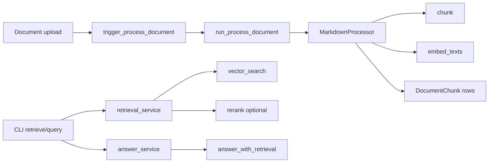

# RAG Pipeline

Technical reference for the working RAG pipeline. Entry points today are the CLI (`retrieve`, `query`) and Celery (`run_process_document`). HTTP routes are defined but not wired.

## Pipeline Overview

**Ingest:**

```
upload → Document row → Celery process_document → MarkdownProcessor → DocumentChunk + pgvector
```

**Query:**

```
query text → embed → vector search → optional rerank → optional LLM answer
```



Key files: `app/rag/processor.py`, `app/rag/retrieval.py`, `app/rag/rerank.py`, `app/rag/generation.py`, `app/services/rag.py`.

## Chunking

Documents are processed by `MarkdownProcessor` (`app/rag/processor.py`), the only processor implemented today.

| Setting | Default | Notes |
|---------|---------|-------|
| `CHUNK_MAX_TOKENS` | 500 | Maximum chunk size |
| `CHUNK_OVERLAP_PERCENT` | 10 | Overlap = 50 tokens at default settings |
| `CHUNK_MIN_TOKENS` | 300 | Configured but not enforced |

**Splitter:** LangChain `RecursiveCharacterTextSplitter` with tiktoken `cl100k_base` token counting.

**Separators** (priority order): `\n## `, `\n### `, `\n#### `, `\n\n`, `\n`, ` ` — splits prefer section boundaries before paragraphs and words.

**Ingest lifecycle** (`process_document`):

1. Set `Document.status = "processing"`
2. Chunk → emit status event `chunking`
3. Batch-embed all chunk texts (batches of 100) → emit `embedding`
4. Delete existing chunks for the document, insert new rows → emit `storing`
5. Set `Document.status = "success"` or `"failed"`

## Embeddings and Similarity

### Embedding model

| Setting | Default |
|---------|---------|
| `EMBEDDING_MODEL` | `openai/text-embedding-3-small` |
| Provider | OpenRouter via OpenAI SDK |
| Vector dimension | 1536 |

At ingest, `embed_texts()` calls `client.embeddings.create()` in batches of 100. At query time, `create_embed_fn()` embeds a single query string.

Embeddings use **raw chunk text only** — title/heading are not prefixed into the embed input on the markdown path.

### Vector store

| Component | Detail |
|-----------|--------|
| Store | PostgreSQL + pgvector |
| Table | `document_chunks` (`DocumentChunk` model) |
| Column | `chunk_vector Vector(1536)` |
| Index | None — sequential scan + sort (HNSW/IVFFlat planned) |

### Distance metric

Search uses pgvector **cosine distance**:

```python
DocumentChunk.chunk_vector.cosine_distance(query_vector)
```

Results are ordered ascending (lower distance = more similar). Distance is converted to a similarity score in `[0, 1]`:

```
similarity = clamp(1 - distance, 0, 1)
```

Implementation: `vector_search()` and `_distance_to_score()` in `app/rag/retrieval.py`.

### Scoping

- `collection` — restricts to `DocumentChunk.collection_id`
- `filters` — applied via `_apply_filters()` (see Metadata below)

## Reranking

Reranking is optional and off by default in the CLI (`--rerank` to enable). The API schema defaults `rerank: true` for when routes are wired.

| Setting | Default |
|---------|---------|
| `RERANK_MODEL` | `cohere/rerank-v3.5` |
| Endpoint | `{OPENROUTER_BASE_URL}/rerank` |

**How it works** (`retrieval_service` in `app/services/rag.py`):

1. When rerank is enabled, vector search fetches **`top_k × 4`** candidates (over-fetch pool).
2. POST to OpenRouter rerank API with `query`, `documents` (chunk texts), and `top_n`.
3. Response maps `index` back to original candidates and `relevance_score` → `rerank_score`.
4. On any failure, falls back to original vector-search order.

Implementation: `create_rerank_fn()` in `app/services/rag.py`, `rerank()` in `app/rag/rerank.py`.

## Metadata

### Stored at ingest (`chunk_metadata` JSONB)

Produced by `MarkdownProcessor.chunk()`:

| Key | Source | Description |
|-----|--------|-------------|
| `section_header` | Nearest preceding markdown heading (`#`–`######`) by character position | Section context for the chunk |
| `all_headings` | Headings found inside the chunk text | List of heading strings |
| `tags` | YAML frontmatter `tags: [a, b]` | Applied to every chunk from that document |

Persisted on `DocumentChunk.chunk_metadata`. A GIN index (`ix_document_chunks_metadata_gin`) supports `@>` containment queries.

Related fields joined at query time (not in chunk metadata):

- `Document.title`, `Document.url`, `Document.created_at`
- `DocumentChunk.collection_id`, `chunk_index`

### Filters at query time

Defined in `app/schemas/query.py` as `Filters`:

| Filter | Behavior |
|--------|----------|
| `metadata` | Exact JSONB containment per key: `chunk_metadata @> {key: value}` |
| `date_range` | Filters `DocumentChunk.created_at` (`after` / `before`) |
| `owner_ref` | Defined but not enforced — silently skipped |

CLI usage: `--filters '{"metadata": {"tags": ["api"]}}'`

### Response shaping

`_chunk_to_retrieval_chunk()` in `app/services/rag.py` builds `ChunkSource`:

- `document` ← `Document.title`
- `url` ← `Document.url`
- `page` ← `chunk_metadata.get("page")` (not set by markdown processor today)

Answer generation sources (`Source` in `app/rag/generation.py`): `chunk_id`, `document_id`, `chunk_index`, `score`.

## Answer Generation

| Setting | Default |
|---------|---------|
| `COMPLETION_MODEL` | `openai/gpt-4o-mini` |
| Provider | OpenRouter via OpenAI SDK |

**Context building** (`build_context` in `app/rag/generation.py`):

1. Normalize chunks — prefer `rerank_score`, else `similarity_score`
2. Sort by score descending, deduplicate by content
3. Format each block as `[source: {document_id}#{chunk_index}]\n{content}`
4. Join with `\n\n`; optional `max_chars` cap (not wired from API/CLI yet)

**Generation:** chat completion with a system prompt requiring answers from context only; admit when context is insufficient.

**Output:** `RagResponse` with `answer` (string) and `sources` (list of `Source`).

## Data Model

```
SystemUser → Collection → Document → DocumentChunk
                              ↓              ↓
                         content (raw)   chunk_vector (1536-d)
                                         chunk_metadata (JSONB)
                                         chunk_index (unique per document)
                                         collection_id (denormalized for scoping)
```

## Configuration

| Variable | Default | Purpose |
|----------|---------|---------|
| `OPENROUTER_API_KEY` | — | Required for embeddings, rerank, and completions |
| `OPENROUTER_BASE_URL` | `https://openrouter.ai/api/v1` | OpenRouter API base |
| `EMBEDDING_MODEL` | `openai/text-embedding-3-small` | Embedding model |
| `COMPLETION_MODEL` | `openai/gpt-4o-mini` | Answer generation model |
| `RERANK_MODEL` | `cohere/rerank-v3.5` | Reranking model |
| `CHUNK_MAX_TOKENS` | 500 | Max chunk size in tokens |
| `CHUNK_OVERLAP_PERCENT` | 10 | Overlap as percentage of max |
| `CHUNK_MIN_TOKENS` | 300 | Not enforced yet |

## Known Limitations

- No vector index (HNSW/IVFFlat) — full table scan
- No hybrid / BM25 search
- `owner_ref` filter not enforced (tenant scoping relies on collection)
- `max_tokens_context` on `BackendQueryRequest` not passed to `build_context()`
- `CHUNK_MIN_TOKENS` configured but unused
- Markdown path embeds raw text without title/heading prefix
- No adjacent-chunk merge before context building
- No embedding or answer caching (Redis used for job status only)

See [ROADMAP_RAG.md](ROADMAP_RAG.md) for the full improvement roadmap.
