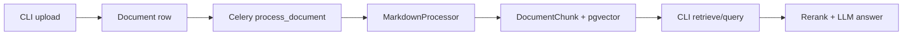
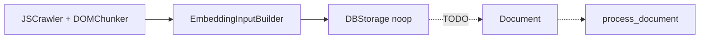

# Roadmap — Project Assessment

**Date:** 2026-07-16

Domain logic for RAG (chunk → embed → retrieve → rerank → answer) and the crawler library (Playwright fetch → DOM chunk) is largely implemented and exercised via **CLI + Celery**. The product surface is incomplete: crawl→DB persistence is stubbed, all business HTTP routes return **501**, and auth/ops hardening is not wired. README “Planned Work” item 3 (implement RAG pipeline) is **obsolete** — RAG indexing and query already work offline.

## Maturity

| Layer | Maturity | Notes |
|-------|----------|--------|
| RAG services (chunk / embed / retrieve / rerank / answer) | High | Works via CLI + Celery; HTTP not wired |
| Documents / collections / system-user services | High | Implemented; CLI-facing |
| Crawler fetch / chunk library | Medium–high | Playwright pipeline works; storage does not persist |
| Crawl → Document → index path | Low | `app/services/crawl.py` returns `"status": "stub"` |
| REST `/v1/*` | Low | Pydantic contracts exist; handlers call `raise_not_implemented()` |
| Security / ops | Low | Auth helpers exist but unwired; no Alembic, CORS, rate limits, CI |

## What works today

User-facing technical reference: [RAG.md](RAG.md).

## What does not

## Scoped roadmaps

Same milestone ladder in each file (A services → B gold-standard → C REST → D security → E bugs/chores), scoped to that domain:

| Doc | Scope |
|-----|--------|
| [ROADMAP_RAG.md](ROADMAP_RAG.md) | Retrieval, generation, document indexing, query/agent API |
| [ROADMAP_CRAWLER.md](ROADMAP_CRAWLER.md) | Crawl pipeline, persist/ingest, crawl API, SSRF |

## Cross-domain ship order

1. **M1** — Crawler persist (`DBStorage` → Document → `process_document`) so crawled content can enter the existing RAG path; RAG tenant/context service fixes in parallel
2. **M2** — RAG quality/efficiency (HNSW, hybrid, context); crawler normalize/dedup/chunk alignment
3. **M3** — Freeze REST contracts (query/agent + crawl) before coding handlers
4. **M4** — Wire HTTP to existing services + API tests
5. **M5** — Auth, rate limits, SSRF, health/ops hardening
6. **M6** — Alembic, CI, doc cleanup, dep fixes, temporary runner removal
