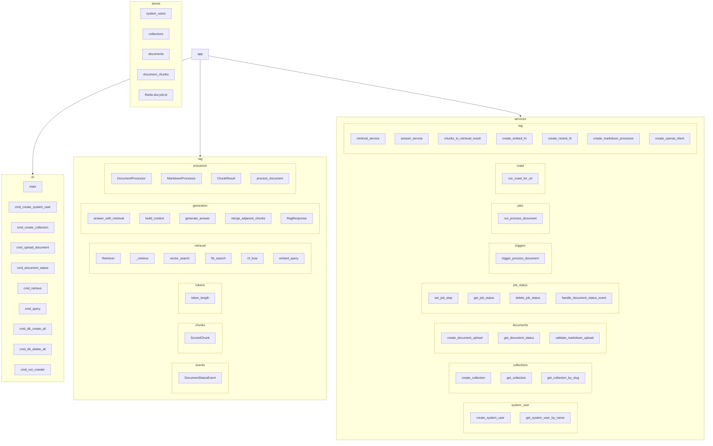
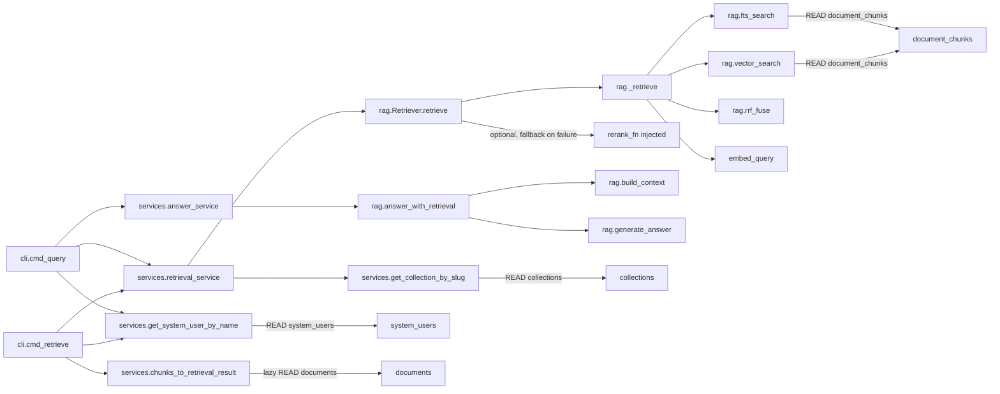
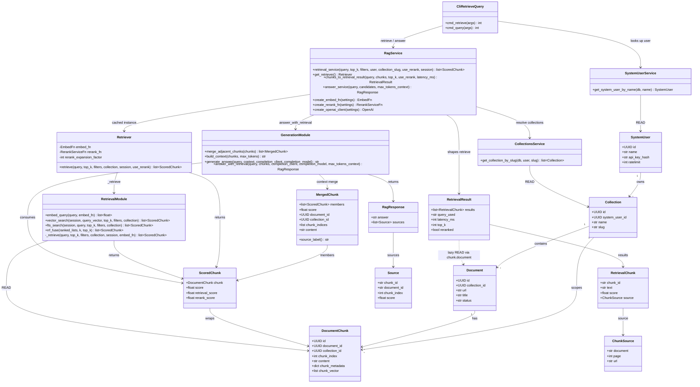
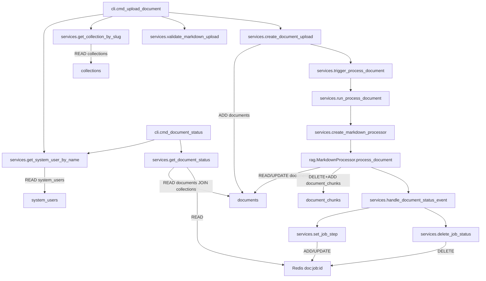
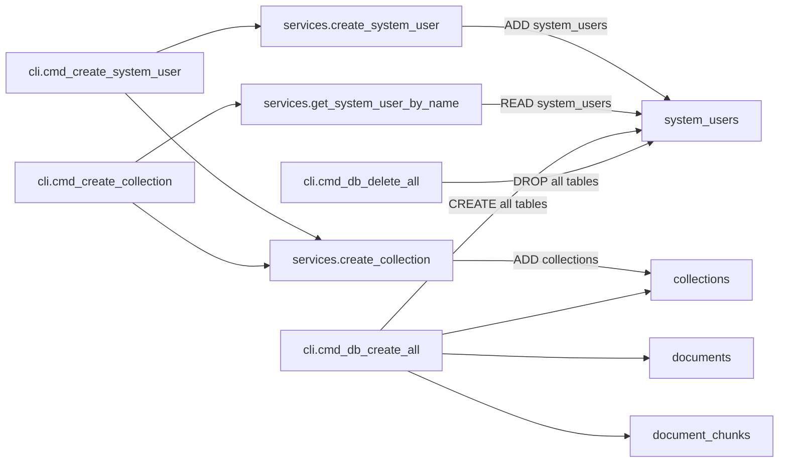

# CRC Cards — cli / rag / services

Scope: [`app/cli.py`](../app/cli.py), [`app/rag/`](../app/rag/), [`app/services/`](../app/services/).

**ORM tables:** `system_users` (`SystemUser`), `collections` (`Collection`), `documents` (`Document`), `document_chunks` (`DocumentChunk`)

**Redis:** `doc:job:{document_id}` (job step progress)

```
app
  cli
    main(argv: list[str] | None = None) -> int
      Responsibility: Parse argparse subcommands and dispatch to the selected cmd_* handler
      Collaborators: all cmd_* handlers; DEFAULT_MAX_PAGES (crawler settings)
      DB: none

    cmd_create_system_user(args: Namespace) -> int
      CLI: create-system-user --name STR --ratelimit INT=100 [--collection NAME[:SLUG]]*
      Responsibility: Provision a system user (print plaintext API key once) and optionally create collections
      Collaborators: SessionLocal, create_system_user, create_collection, _parse_collection_arg
      DB: ADD system_users (SystemUser); ADD collections (Collection) when --collection given

    cmd_create_collection(args: Namespace) -> int
      CLI: create-collection --name STR --collection NAME[:SLUG]
      Responsibility: Look up a system user by name and create one collection; print JSON
      Collaborators: SessionLocal, get_system_user_by_name, create_collection, _parse_collection_arg
      DB: READ system_users (SystemUser); ADD collections (Collection)

    cmd_upload_document(args: Namespace) -> int
      CLI: upload-document --path PATH+ --name STR --collection-slug STR [--json]
      Responsibility: Validate and upload one or more .md files into a collection; queue Celery indexing
      Collaborators: _expand_upload_paths, get_system_user_by_name, get_collection_by_slug,
                     validate_markdown_upload, create_document_upload
      DB: READ system_users, collections; ADD documents (Document)
          (async via Celery: UPDATE documents; DELETE+ADD document_chunks)

    cmd_document_status(args: Namespace) -> int
      CLI: document-status --document-id STR --name STR
      Responsibility: Print JSON processing status for a document owned by the named system user
      Collaborators: get_system_user_by_name, get_document_status
      DB: READ system_users, documents JOIN collections
      Redis: READ doc:job:{document_id} (via get_document_status)

    cmd_retrieve(args: Namespace) -> int
      CLI: retrieve --query STR --name STR [--collection-slug STR] [--top-k INT=5]
                    [--rerank] [--filters JSON] [--json]
      Responsibility: Hybrid/vector retrieve (optional rerank); print ranked chunks or JSON RetrievalResult
      Collaborators: _parse_filters, get_system_user_by_name, retrieval_service, chunks_to_retrieval_result
      DB: READ system_users, collections, document_chunks; lazy READ documents (source shaping)

    cmd_query(args: Namespace) -> int
      CLI: query (same as retrieve) [--max-tokens-context INT]
      Responsibility: Retrieve then generate a grounded LLM answer; always print JSON RagResponse
      Collaborators: retrieval_service, answer_service (+ same lookup path as retrieve)
      DB: READ system_users, collections, document_chunks; lazy READ documents

    cmd_db_create_all(args: Namespace) -> int
      CLI: db create-all  (APP_ENV=development only)
      Responsibility: Ensure vector extension and create all ORM tables
      Collaborators: _require_development, create_all_tables, app.models
      DB: CREATE SCHEMA for system_users, collections, documents, document_chunks (+ vector extension)

    cmd_db_delete_all(args: Namespace) -> int
      CLI: db delete-all  (APP_ENV=development only)
      Responsibility: Drop all ORM tables known to Base.metadata
      Collaborators: _require_development, drop_all_tables
      DB: DROP all of the above tables

    cmd_run_crawler(args: Namespace) -> int
      CLI: run-crawler --url URL+ [--max-pages INT] [--no-headless] [--job-id STR]
      Responsibility: Local crawl debug entry (currently always raises NotImplementedError)
      Collaborators: (unreachable) run_crawl_debug, count_crawl_results
      DB: none

  rag
    events
      DocumentStatusEvent(document_id: str, step: StepName, status: StepStatus)
        Responsibility: Immutable status event emitted during document processing
        Collaborators: none (data-only)
        DB: none
        Types: StepName = Literal["chunking","embedding","storing","failed"]
               StepStatus = Literal["in_progress","completed"]
               DocumentStatusHandler = Callable[[DocumentStatusEvent], None]

    chunks
      ScoredChunk(chunk: DocumentChunk, score: float,
                  retrieval_score: float | None = None, rerank_score: float | None = None)
        Responsibility: Unified chunk+score type for every pipeline stage;
                        score always holds the current-stage score (never None)
        Collaborators: DocumentChunk
        DB: holds DocumentChunk in memory only

    tokens
      token_length(text: str) -> int
        Responsibility: tiktoken cl100k_base token count (encoding cached via lru_cache)
        Collaborators: tiktoken
        DB: none

    retrieval
      embed_query(query: str, embed_fn: EmbedFn) -> list[float]
        Responsibility: Embed the query via the injected embed_fn
        Collaborators: EmbedFn (injected)
        DB: none

      vector_search(session: Session, query_vector: list[float], *, top_k: int,
                    filters: dict | None, collection: list[str]) -> list[ScoredChunk]
        Responsibility: pgvector cosine-distance ANN over chunks scoped to collection IDs
        Collaborators: _apply_hnsw_session_settings, _apply_filters, _distance_to_score, get_settings
        DB: READ document_chunks (DocumentChunk.chunk_vector); SET LOCAL HNSW session GUCs

      fts_search(session: Session, query: str, *, top_k: int,
                 filters: dict | None, collection: list[str]) -> list[ScoredChunk]
        Responsibility: Postgres FTS (simple config) on content_tsv ranked by ts_rank_cd
        Collaborators: _build_tsquery, _apply_filters
        DB: READ document_chunks (content_tsv @@ tsquery)

      rrf_fuse(ranked_lists: list[list[ScoredChunk]], *, k: int = 60,
               top_k: int) -> list[ScoredChunk]
        Responsibility: Merge ranked lists with Reciprocal Rank Fusion; ties break by chunk id
        Collaborators: ScoredChunk, DocumentChunk (ids)
        DB: none

      _retrieve(query: str, top_k: int, filters: dict | None, collection: list[str], *,
               session: Session, embed_fn: EmbedFn) -> list[ScoredChunk]
        Responsibility: Hybrid vector+FTS → RRF (or vector-only when hybrid_search_enabled is false);
                        private helper — public entrypoint is Retriever.retrieve
        Collaborators: embed_query, vector_search, fts_search, rrf_fuse, get_settings
        DB: READ document_chunks (via vector_search / fts_search); none ADD/UPDATE

      Retriever(embed_fn: EmbedFn, rerank_fn: RerankServiceFn | None = None,
                rerank_expansion_factor: int = 4)
        retrieve(self, query, top_k, filters, collection, *, session,
                 use_rerank=False) -> list[ScoredChunk]
          Responsibility: Orchestrate _retrieve + optional rerank; owns the over-fetch
                          policy (top_k * rerank_expansion_factor); on missing/failing
                          rerank provider falls back to retrieval order truncated to top_k
          Collaborators: _retrieve, RerankServiceFn (injected), ScoredChunk
          DB: READ document_chunks (via _retrieve)
        Types: RerankServiceFn = Callable[[str, int, list[ScoredChunk]], list[ScoredChunk]]

    generation
      Source(chunk_id: str, document_id: str, chunk_index: int, score: float)
        Responsibility: Pydantic source citation on a RagResponse
        DB: none

      RagResponse(answer: str, sources: list[Source])
        Responsibility: Grounded answer plus source list returned to callers
        DB: none

      MergedChunk(members: list[ScoredChunk], score: float)
        + document_id / collection_id / chunk_indices / content (properties)
        + source_label(self) -> str
        Responsibility: Adjacent same-document chunks merged for context packing
        Collaborators: _strip_leading_overlap, ScoredChunk (rag.chunks)
        DB: reads fields on in-memory DocumentChunk only

      merge_adjacent_chunks(chunks: list[ScoredChunk]) -> list[MergedChunk]
        Responsibility: Group by (collection_id, document_id); merge runs where chunk_index differs by 1
        Collaborators: MergedChunk, ScoredChunk
        DB: none

      build_context(chunks: list[ScoredChunk], *, max_tokens: int | None = None) -> str
        Responsibility: Merge adjacent chunks, dedupe by content, pack [source: …] blocks until max_tokens
        Collaborators: merge_adjacent_chunks, token_length (rag.tokens)
        DB: none

      generate_answer(query: str, context: str, completion_client, *,
                      completion_model: str) -> str
        Responsibility: Call completion_client.chat.completions.create with grounded system prompt
        Collaborators: OpenAI-compatible completion client (injected)
        DB: none

      answer_with_retrieval(query: str, chunks: list[ScoredChunk], completion_client, *,
                            completion_model: str,
                            max_tokens_context: int | None = None) -> RagResponse
        Responsibility: Build context, generate answer, attach per-chunk Source list
        Collaborators: build_context, generate_answer, Source, RagResponse
        DB: none

    processor
      ChunkResult(content: str, metadata: dict)
        Responsibility: One chunk text + metadata from splitting
        DB: none

      DocumentProcessor(ABC)
        __init__(self, client: OpenAI, model: str) -> None
          Responsibility: Store OpenAI client and embedding model name
          DB: none

        chunk(self, content: str) -> list[ChunkResult]   [abstractmethod]
          Responsibility: Split document content into chunks with metadata
          DB: none

        embed_texts(self, texts: list[str]) -> list[list[float]]
          Responsibility: Batch-embed texts (BATCH_SIZE=100) via client.embeddings.create
          Collaborators: openai.OpenAI
          DB: none

        process_document(self, db: Session, document_id: str, *,
                         on_status: DocumentStatusHandler) -> None
          Responsibility: Load doc → processing → chunk → embed → replace chunks → success;
                          on error rollback, set failed + error_message, re-raise
          Collaborators: self.chunk, self.embed_texts, DocumentStatusEvent, on_status,
                         build_contextualized_embedding_text
          DB: READ documents (Document)
              UPDATE documents (status, error_message)
              DELETE document_chunks for document_id
              ADD document_chunks (document_id, collection_id, chunk_index, content,
                                  chunk_metadata, chunk_vector)

      MarkdownProcessor(DocumentProcessor)
        __init__(self, client: OpenAI, model: str, *, chunk_max_tokens: int,
                 chunk_min_tokens: int, chunk_overlap_percent: float) -> None
          Responsibility: Configure token-based split sizes/overlap
          DB: none

        chunk(self, content: str) -> list[ChunkResult]
          Responsibility: RecursiveCharacterTextSplitter (token length), merge undersized chunks,
                          attach section_header / all_headings / frontmatter tags
          Collaborators: RecursiveCharacterTextSplitter, token_length (rag.tokens), ChunkResult,
                         self._extract_frontmatter_tags / _build_heading_index /
                         _nearest_heading / _merge_undersized_chunks (private methods)
          DB: none

  services
    system_user
      SystemUserLookupError
        Responsibility: Raised when name lookup finds zero or multiple users

      create_system_user(db: Session, *, name: str, ratelimit: int = 100)
                        -> tuple[SystemUser, str]
        Responsibility: Provision a system user with hashed API key; return (user, plaintext_key)
        Collaborators: generate_api_key, hash_api_key, get_settings, SystemUser
        DB: ADD system_users (SystemUser)

      get_system_user_by_name(db: Session, name: str) -> SystemUser
        Responsibility: Look up exactly one system user by name
        Collaborators: SystemUser
        DB: READ system_users (SystemUser)

    collections
      CollectionNotFoundError / CollectionConflictError
        Responsibility: Missing collection vs unique-slug conflict

      create_collection(db: Session, user: SystemUser, name: str,
                        slug: str | None = None) -> Collection
        Responsibility: Create a collection for a system user (slug derived if omitted)
        Collaborators: _derive_slug, Collection, SystemUser
        DB: ADD collections (Collection)

      get_collection(db: Session, user: SystemUser, collection_id: UUID) -> Collection
        Responsibility: Fetch one collection by ID scoped to the user
        Collaborators: Collection, SystemUser
        DB: READ collections (Collection)

      get_collection_by_slug(db: Session, user: SystemUser,
                             slug: str | None = None) -> list[Collection]
        Responsibility: Return one collection by slug, or all of the user’s collections if slug is None
        Collaborators: Collection, SystemUser
        DB: READ collections (Collection)

    documents
      ValidationResult(valid: bool, reason: str | None = None)
        Responsibility: Result of markdown upload validation
        DB: none

      DocumentConflictError / DocumentNotFoundError
        Responsibility: Duplicate filename vs missing/unauthorized document

      validate_markdown_upload(filename: str, content: bytes) -> ValidationResult
        Responsibility: Require .md, UTF-8 text, non-empty, non-binary
        Collaborators: none
        DB: none

      create_document_upload(db: Session, collection: Collection, filename: str,
                             content: str) -> Document
        Responsibility: Insert a document, commit, queue background processing
        Collaborators: trigger_process_document, Document, Collection
        DB: ADD documents (Document: collection_id, title, url, content, status=None)

      get_document_status(db: Session, user: SystemUser,
                          document_id: UUID) -> DocumentStatusResponse
        Responsibility: Return status merging DB row with Redis step progress when present
        Collaborators: job_status.get_job_status, DocumentStatusResponse, Document, Collection
        DB: READ documents JOIN collections (scoped by system_user_id)
        Redis: READ doc:job:{document_id}

    job_status
      set_job_step(document_id: str, step: StepName, step_status: StepStatus) -> None
        Responsibility: Upsert Redis job payload with current step, steps map, updated_at (TTL 24h)
        Collaborators: _get_redis, _job_key, _default_steps
        DB: none
        Redis: READ then ADD/UPDATE doc:job:{id}

      get_job_status(document_id: str) -> dict | None
        Responsibility: Load and parse the Redis job status payload, or None
        Redis: READ doc:job:{id}
        DB: none

      delete_job_status(document_id: str) -> None
        Responsibility: Delete the Redis job status key
        Redis: DELETE doc:job:{id}
        DB: none

      handle_document_status_event(event: DocumentStatusEvent) -> None
        Responsibility: Map RAG pipeline status events into Redis updates;
                        clear key on failure or successful store completion
        Collaborators: DocumentStatusEvent, set_job_step, delete_job_status
        Redis: via set_job_step / delete_job_status
        DB: none

    triggers
      trigger_process_document(document_id: str) -> str
        Responsibility: Enqueue Celery run_process_document; return Celery task id
        Collaborators: run_process_document.delay
        DB: none

    jobs
      celery_app: Celery
        Responsibility: Celery app (broker=celery_broker_url, backend=redis_url)
        DB: none

      run_process_document(self, document_id: str) -> None
        (Celery task: name="run_process_document", bind=True, max_retries=0)
        Responsibility: Open DB session, build MarkdownProcessor, run chunk/embed/store
        Collaborators: SessionLocal, create_markdown_processor, handle_document_status_event,
                       MarkdownProcessor.process_document
        DB: via process_document — READ/UPDATE documents; DELETE+ADD document_chunks
        Redis: via on_status=handle_document_status_event

    crawl
      run_crawl_for_url(db: Session, url: str, collection_id: UUID, *,
                        max_pages: int = DEFAULT_MAX_PAGES,
                        headless: bool = DEFAULT_HEADLESS,
                        job_id: str | None = None) -> dict
        Responsibility: Compose crawl pipeline (JS crawl → DOM chunk → embedding input → DBStorage stub)
        Collaborators: StageContext, Pipeline, JSCrawler, DOMChunker, EmbeddingInputBuilder, DBStorage
        DB: Session passed to DBStorage but DBStorage does not persist yet (status: "stub")

    rag
      retrieval_service(query: str, top_k: int, filters: dict | None, *,
                        user: SystemUser, collection_slug: str | None = None,
                        use_rerank: bool = False, session: Session)
                      -> list[ScoredChunk]
        Responsibility: Resolve tenant collections, delegate to the cached Retriever
        Collaborators: get_collection_by_slug, get_retriever, Retriever.retrieve
        DB: READ collections (via get_collection_by_slug);
            READ document_chunks (via Retriever.retrieve)

      get_retriever() -> Retriever   (lru_cache, one per process)
        Responsibility: Build the Retriever once (embed/rerank providers,
                        rerank_expansion_factor from settings)
        Collaborators: Retriever, create_embed_fn, create_rerank_fn, get_settings
        DB: none

      chunks_to_retrieval_result(query: str, chunks: list[ScoredChunk], *,
                                 top_k: int, use_rerank: bool,
                                 latency_ms: int | None = None) -> RetrievalResult
        Responsibility: Wrap scored chunks into the API RetrievalResult response shape
        Collaborators: _chunk_to_retrieval_chunk, RetrievalResult
        DB: possible lazy READ documents via chunk.document relationship

      answer_service(query: str, candidates: list[ScoredChunk], *,
                     max_tokens_context: int | None = None) -> RagResponse
        Responsibility: Build context from chunks and call completion model for grounded answer
        Collaborators: create_openai_client, answer_with_retrieval, get_settings
        DB: none

      create_openai_client(settings: Settings) -> OpenAI
        Responsibility: Build OpenRouter-backed OpenAI client; raise if API key missing
        Collaborators: openai.OpenAI, Settings
        DB: none

      create_embed_fn(settings: Settings) -> EmbedFn
        Responsibility: Return a closure that embeds a single text via the configured embedding model
        Collaborators: create_openai_client
        DB: none

      create_rerank_fn(settings: Settings) -> RerankServiceFn
        Responsibility: Return a closure that POSTs to OpenRouter /rerank and remaps to
                        ScoredChunk (rerank_score set, retrieval_score preserved)
        Collaborators: httpx.post, ScoredChunk
        DB: none

      create_markdown_processor(settings: Settings) -> MarkdownProcessor
        Responsibility: Construct MarkdownProcessor with embedding client and chunk-size settings
        Collaborators: MarkdownProcessor, create_openai_client
        DB: none (factory only)
```

## Graph view

### Package hierarchy



### Retrieve / query collaboration



### Retrieve / query class diagram



### Upload / process collaboration



### Tenant / schema CLI collaboration


